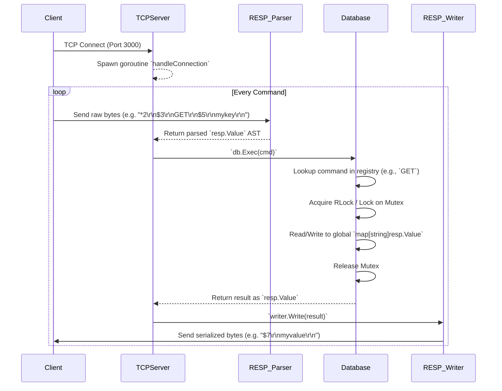

# Multi-Threaded Redis Architecture and Data Flow

This document outlines the current architecture of the `multi-threaded-Redis` clone, the lifecycle of a request, and the roadmap for the future multi-threaded I/O model.

## Component Overview

The codebase is modularized into several key components:

- **`TCPServer/`**: The entry point for the network. It listens on port 3000, accepts incoming connections, and orchestrates the data flow for each client.
- **`Internal/resp/`**: The Redis Serialization Protocol (RESP) layer.
  - `Parser`: Converts incoming raw TCP byte streams into structured `resp.Value` objects.
  - `Writer`: Converts `resp.Value` objects back into raw bytes to send over the network.
- **`Internal/database/`**: The core data engine.
  - `Database`: Holds the global in-memory key-value dictionary (`map[string]resp.Value`) and a `sync.RWMutex` for concurrent safety.
  - `command.go`: A registry mapping command names (like `PING`, `GET`) to execution functions.
  - `keys.go`: The actual implementations for mutating and reading the dictionary state.
- **`Internal/core/io_multiplexing/`**: *(Future)* A Linux `epoll` wrapper to support highly scalable, non-blocking event loops.
- **`ThreadPool/`**: *(Future)* A worker pool implementation to handle concurrent parsing and I/O tasks.

---

## Current Request Lifecycle (Goroutine-Per-Connection)

Currently, the server operates using the standard Go `net` pattern (one goroutine per client). 



### Flow Breakdown:
1. **Acceptance**: `listener.Accept()` blocks until a client connects. A new goroutine is spawned for the client.
2. **Parsing**: The `resp.Parser` reads from the connection until a full RESP command is constructed.
3. **Execution**: The command is dispatched to `db.Exec(cmd)`. The database engine routes the command to the correct handler (`execSet`, `execGet`).
4. **Thread Safety**: Because multiple goroutines (clients) could be writing to the map simultaneously, the `Database` uses a `sync.RWMutex`.
5. **Response**: The resulting data is passed to the `resp.Writer`, which formats it according to the RESP spec and flushes it to the client.

---

## Future Roadmap: Multi-Threaded I/O Architecture

In standard Redis < 6.0, execution was entirely single-threaded. Redis 6.0 introduced "Threaded I/O", where reading/parsing and writing/formatting are offloaded to worker threads, but the actual database execution remains single-threaded to avoid expensive mutex locks.

We have the foundational blocks (`ThreadPool` and `epoll`) to implement this architecture next:

```mermaid
graph TD
    A[epoll Event Loop (Main Thread)] -->|Socket Readable| B(ThreadPool Worker)
    B -->|Read & Parse RESP| C{Command Queue}
    C -->|Dequeue| D[Single-Threaded DB Executor]
    D -->|Execute (No Mutex Needed!)| E[Global Map]
    D -->|Push Result| F{Response Queue}
    F -->|Dequeue| G(ThreadPool Worker)
    G -->|Serialize & Write| H[Client Socket]
```

### Next Steps to Achieve This:
1. Move away from `net.Listener` blocking and use `epoll` (or `netpoll`) to monitor sockets.
2. Dispatch socket read events to the `ThreadPool`.
3. Have the `ThreadPool` parse the RESP command and send the `resp.Value` to a central Go channel (`Command Queue`).
4. Have a single, dedicated goroutine pop from the `Command Queue` and run `db.Exec()`. This removes the need for `sync.RWMutex` entirely.
5. Have the single thread push the result back to a response queue for a worker thread to serialize and send back to the client.
